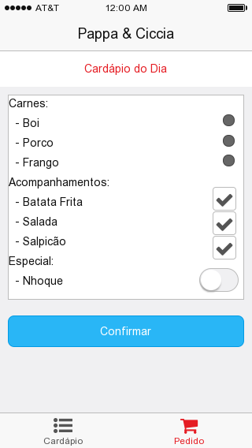

# Requisitos - App Pappa & Ciccia [Protótipo]

Sistema para pedido de almoço para diminuir a espera de preparo, onde o cliente através do app seleciona as opções de prato e informa a hora de chegada no restaurante. O administrador recebe a notificação no smartphone e dá início a preparação do prato. Portanto, haverá duas visões do sistema, uma para o cliente fazer o pedido e a versão do administrador, para 
consulta dos pedidos feitos. Além do backend, que vai disponibilizar um weservice para 
o admin cadastrar o cardápio do dia e receber os pedidos e outro para o usuário consultar o cardápio e fazer o pedido.

Como se trata de um protótipo, algums elementos considerados importantes, mas não fundamentais para o funcionamento do app serão suprimidos, são eles:

- Cadastro de novo usuário na visão do cliente
	- O cliente deve ser cadastrado pelo administrador para utilizar o serviço. 
Posteriormente, o cliente poderá se cadastrar usando sua conta do Facebook, 
por exemplo.
- Notificação
	- Não haverá push notification no protótipo. O admin deve atualizar a lista de pedidos
manualmente, assim como o cliente para receber o cardápio.


# Visão do cliente
A especificação atual se preocupa com o core do app, ou seja, no caso do app cliente, receber o cardápio do dia e realizar o pedido. Posteriormente será acrescentado login, histórico de pedidos, cancelamentos, pagamento on-line, etc.

##Wireframe




## Atores
- Admin
- Cliente


## Casos de Uso

- Menu do dia
	- Matriz de opções:
	- [carnes], [acompanhamentos], [sucos] 
- Pedido
	- Número pedido (para consulta do cliente e admin)
	- Cliente
	- Selecionar uma ou mais opções de cada elemento do menu
	- Hora de chegada no restaurante
	- Push notification para o admin de novo pedido
	- Quantidade


## Tabelas

- cliente
	- token ou id
- menu
	- data
	- cod_categoria
- menu_categoria
	- cod_categoria
	- descricao
	- modificadores (json)
- opcoes_categoria
	- cod_categoria
	- cod_opcao
	- descricao
- pedido
	- cod_pedido
	- data_hora
	- hora_chegada
	- quantidade
- pedido_item
	- cod_pedido
	- cod_opcao
	- quantidade


#Webservice Cliente

O webservice será um REST que pode ficar hospedado num serviço de BaaS como Parse, Heroku, etc. 
* Caso seja utilizado ReactNative para os app, consultar [ParseReact](https://github.com/ParsePlatform/ParseReact) 

##Interface do serviço

```
GET service.com/app/cardapio?data=20151005
{
	data: 20151005,
	menu: [
	{categoria: 'Carnes', 
		opcoes: [{id: 1, nome: 'Frango'},{id: 2, nome: 'Carne Boi'}], 
		modificador: ['unico']}
  	{categoria: 'Acomp.', 
		opcoes: [{id: 1, nome: 'Salada'},{id: 2, nome: 'Batata'}, {id: 3, nome: 'Salpicão'}], 
		modificador: ['max-2']}
	]
}


POST service.com/app/pedido/novo
{
	cliente: 1002, 
	hora_chegada: '20151005 12:00', 
	pedido: [{categoria: 1, selecionados: [1]}, {categoria: 2, selecionados: [1,3]}]
}

```


